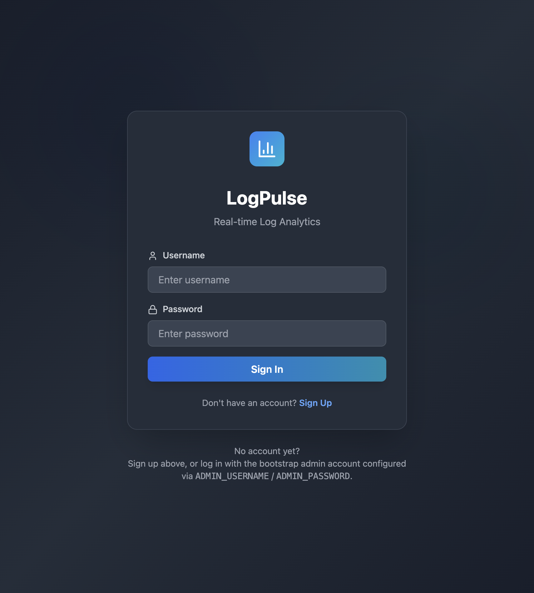
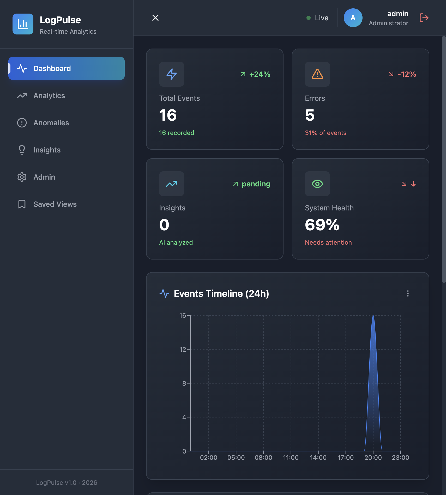
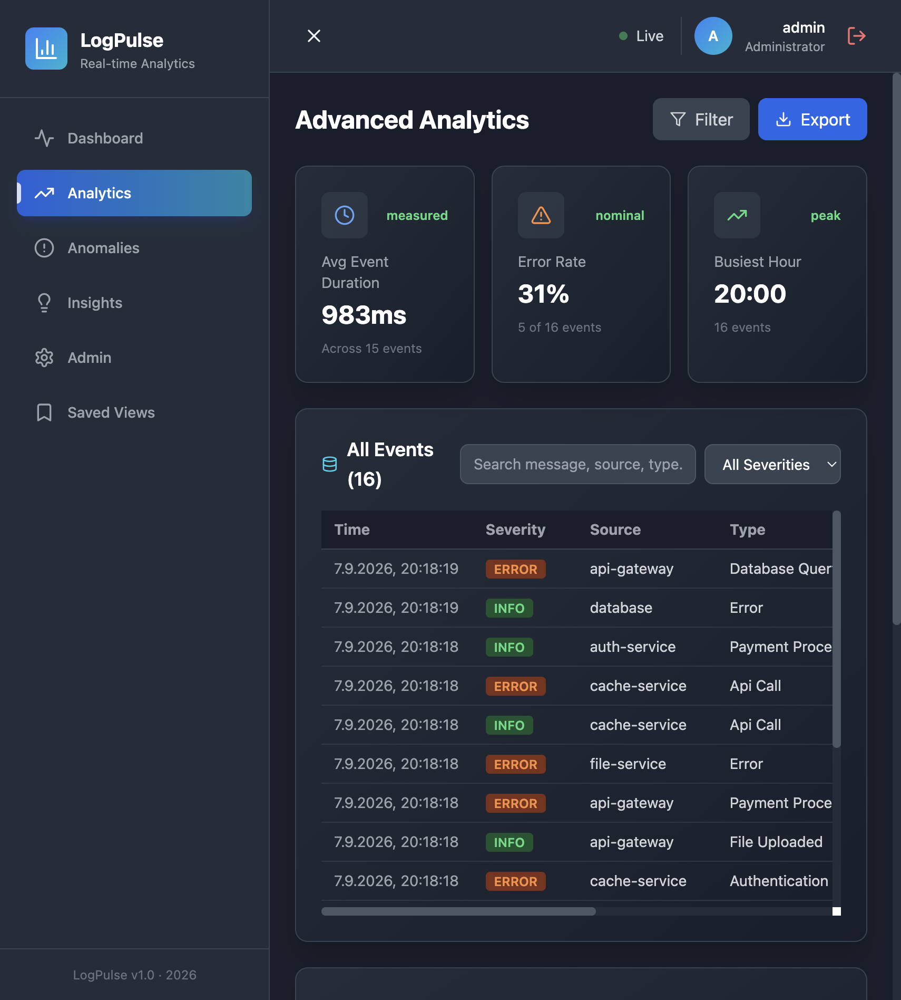
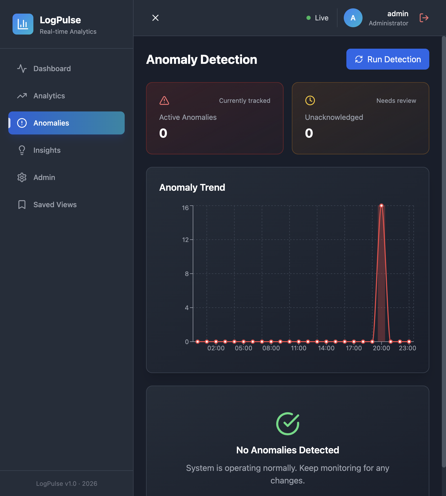
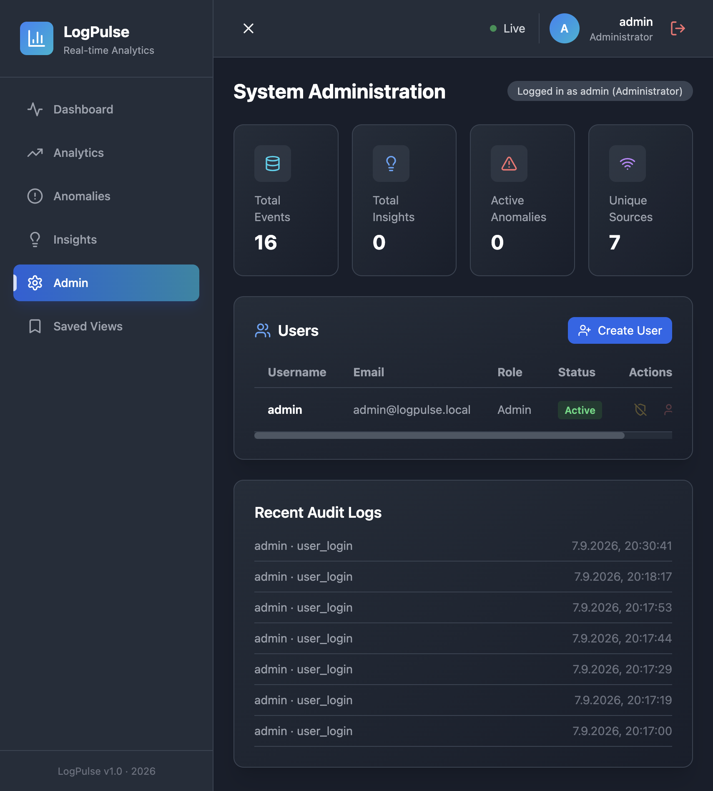

# LogPulse

Real-time log analytics and AI-powered insights engine. Built with FastAPI, PostgreSQL, Redis, and LLM integration for asynchronous event processing and automated analysis.

## Overview

LogPulse ingests high-volume event streams via HTTP/WebSocket, processes them asynchronously, and generates AI-driven performance and security insights using LLMs. Designed for production workloads with emphasis on reliability, observability, and scalability.

## Screenshots

| Login | Dashboard |
|---|---|
|  |  |

| Analytics | Anomaly Detection |
|---|---|
|  |  |

| Admin |
|---|
|  |

## Technology Stack

- **Framework**: FastAPI (Python 3.11+)
- **Database**: PostgreSQL 14+ with SQLAlchemy 2.0 (async ORM)
- **Cache/Broker**: Redis 7+
- **Task Queue**: Celery with Redis backend
- **LLM Integration**: LangChain + OpenAI API
- **Testing**: Pytest with async support
- **Code Quality**: Ruff, MyPy, Black
- **Infrastructure**: Docker, Docker Compose, GitHub Actions

## Features

- Real-time event ingestion via REST API and WebSocket
- Asynchronous background task processing with Celery
- AI-powered insight generation with LLM integration
- Type-safe with Pydantic v2 and full type hints
- Comprehensive test coverage with Pytest
- Production-ready Docker images and Kubernetes-ready
- Database connection pooling and query optimization
- Structured logging with context preservation
- CORS and security middleware configured
- Health check and metrics endpoints

## Quick Start

### Prerequisites

- Python 3.11 or later
- PostgreSQL 14 or later
- Redis 7 or later
- Docker and Docker Compose (recommended)

### Installation

1. Clone and navigate to the project:

```bash
git clone <repository-url>
cd logpulse
```

2. Create virtual environment and install dependencies:

```bash
python -m venv venv
source venv/bin/activate
pip install -r requirements-dev.txt
```

3. Configure environment:

```bash
cp .env.example .env
# Update .env with your PostgreSQL, Redis, and OpenAI credentials
```

4. Start services (Docker Compose):

```bash
docker-compose up -d
```

This starts:
- FastAPI application (localhost:8000)
- PostgreSQL database
- Redis cache
- Celery worker
- Celery Flower monitoring (localhost:5555)

5. Access API documentation:

- Interactive Docs: http://localhost:8000/docs
- ReDoc: http://localhost:8000/redoc
- Health Check: http://localhost:8000/health

## API Endpoints

### Events

- `POST /api/v1/events` - Create event
- `GET /api/v1/events` - List events with optional filtering
- `GET /api/v1/events/{event_id}` - Get event details
- `DELETE /api/v1/events/{event_id}` - Delete event

### Insights

- `GET /api/v1/insights` - List AI insights
- `GET /api/v1/insights/high-confidence` - High confidence insights only

### Analytics

- `GET /api/v1/analytics/statistics` - Event statistics
- `GET /api/v1/analytics/summary` - Summary report

### Authentication

- `POST /api/v1/auth/register` - Register user
- `POST /api/v1/auth/login` - Login and receive JWT token

### Anomalies

- `GET /api/v1/anomalies/alerts` - List detected anomalies
- `GET /api/v1/anomalies/summary` - Anomaly counts summary
- `POST /api/v1/anomalies/detect` - Run anomaly detection
- `PATCH /api/v1/anomalies/acknowledge/{anomaly_id}` - Acknowledge an anomaly

### Saved Views

- `GET /api/v1/saved-views` - List saved filter views
- `POST /api/v1/saved-views` - Create a saved view
- `PATCH /api/v1/saved-views/{view_id}` - Update a saved view
- `DELETE /api/v1/saved-views/{view_id}` - Delete a saved view

### Admin (admin role required)

- `GET /api/v1/admin/users` - List users
- `POST /api/v1/admin/users` - Create a user
- `DELETE /api/v1/admin/users/{user_id}` - Delete a user
- `PATCH /api/v1/admin/users/{user_id}/admin` - Grant/revoke admin
- `PATCH /api/v1/admin/users/{user_id}/activate` / `deactivate` - Toggle account status
- `GET /api/v1/admin/audit-logs` - List audit log entries

## Development

### Code Quality

```bash
# Run all checks
make lint

# Format code
make format

# Type checking
mypy app/
```

### Testing

```bash
# Run tests with coverage
pytest --cov=app --cov-report=html
```

### Database Migrations

Schema changes are currently applied via raw SQL files in `migrations/` (run manually against the database, e.g. `psql -f migrations/002_add_features_tables.sql`). Alembic is included in `requirements.txt` for future use but is not yet configured (no `alembic.ini`/`env.py`).

### Project Structure

```
app/
├── api/v1/                  # API routes and endpoints
├── core/                    # Configuration, security, and admin bootstrap
├── db/                      # Database session and base
├── models/                  # SQLAlchemy ORM models
├── schemas/                 # Pydantic validation schemas
├── services/                # Business logic layer
├── tasks/                   # Celery async tasks
├── utils/                   # Utilities (logging, etc.)
└── __init__.py              # App factory

tests/                       # Unit and integration tests
docker/                      # Docker images
.github/workflows/           # CI/CD pipelines
migrations/                  # Database migrations
```

## Deployment

### Docker Compose (Development/Small Scale)

```bash
docker-compose up -d
```

### Production Checklist

- Set `DEBUG=False`
- Configure strong `SECRET_KEY`
- Set up external PostgreSQL and Redis (not containerized)
- Configure `ALLOWED_HOSTS` for your domain
- Use HTTPS with valid SSL certificate
- Set up log aggregation (Datadog, ELK, etc.)
- Configure monitoring and alerting
- Set up automated backups

## Configuration

All configuration is managed through environment variables. Key settings:

- `DATABASE_URL` - PostgreSQL connection string
- `REDIS_URL` - Redis connection for caching
- `CELERY_BROKER_URL` - Redis connection for task broker
- `OPENAI_API_KEY` - LLM API key
- `SECRET_KEY` - JWT signing key
- `DEBUG` - Development mode flag
- `LOG_LEVEL` - Logging verbosity (DEBUG, INFO, WARNING, ERROR)
- `CORS_ORIGINS` - CORS allowed origins
- `ADMIN_USERNAME` / `ADMIN_EMAIL` / `ADMIN_PASSWORD` - Bootstrap admin account created (or promoted) on startup; leave `ADMIN_PASSWORD` empty to disable

## Monitoring

- **Health Check**: GET `/health`
- **API Docs**: GET `/docs`
- **Celery Tasks**: Flower UI at localhost:5555
- **Logs**: Written to `logs/app.log` and stdout

## Testing

The project includes comprehensive tests:

- Unit tests for services and models
- Integration tests for API endpoints
- Database fixtures run against a real PostgreSQL instance (models use Postgres-only types like UUID/JSONB, so SQLite cannot be used)
- Async test support with pytest-asyncio

Start a database before running tests locally:

```bash
docker-compose up -d db
pytest --cov=app --cov-report=html
```

## Contributing

1. Create feature branch: `git checkout -b feature/name`
2. Make changes and commit: `git commit -m "Description"`
3. Push branch: `git push origin feature/name`
4. Open Pull Request

## License

MIT License - See [LICENSE](LICENSE) for details
